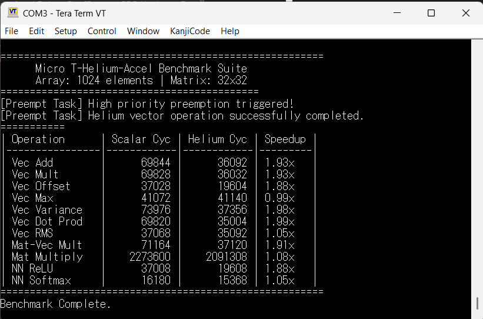

# Micro T-Helium-Accel
> **Hardware-Accelerated Math Middleware for μT-Kernel 3.0 on Renesas EK-RA8P1 (ARM Cortex-M85)**
> *TRON Programming Contest 2026 Submission — RTOS Middleware Category*

[-orange)](https://www.arm.com/)

---

## Overview
**Micro T-Helium-Accel** is a high-performance math middleware engineered for **μT-Kernel 3.0**. It exposes the ARM Cortex-M85 Helium (MVE — Vector Extension) hardware acceleration unit through a clean, thread-safe C API.

Designed specifically for **TRON × AI** and edge DSP workloads, this middleware enables RTOS tasks to execute matrix multiplications, vector arithmetic, and neural network activation functions (ReLU, Softmax, Sigmoid, Tanh) with hardware acceleration while maintaining absolute task preemption safety under μT-Kernel 3.0.

---

## Development & Build Environment
- **Microcontroller Board:** Renesas EK-RA8P1[cite: 2]
- **Target MCU:** R7KA8P1KFLCAC (Cortex-M85 / CPU0)[cite: 2]
- **IDE:** Renesas e2 studio
- **Flexible Software Package (FSP):** v6.5.0[cite: 2]
- **Toolchain:** GCC ARM Embedded 13.2.1.arm-13-7[cite: 2]
- **CMSIS Component:** Arm CMSIS Version 6 - Core (M) v6.1.0+fsp.6.5.0[cite: 2]

---

## Repository Structure

    .
    ├── Demo_project/       # Complete Renesas e2 studio project (verified in Debug Mode)
    ├── doc/                # Detailed documentation (Operation & Evaluation Manual)
    │   └── OPERATION_MANUAL.md
    ├── inc/                # Middleware header files (micro_helium_math.h, dwt_timer.h)
    ├── src/                # Middleware source files (micro_helium_math.c, benchmark.c, usermain.c)
    ├── benchmark.png       # Console output image showing hardware benchmark results
    └── LICENSE             # MIT Open Source License

---

## Key Features
- **TRON × AI Alignment:** Hardware acceleration for matrix-matrix multiplication, matrix-vector multiplication, and neural network activations (`ReLU`, `Softmax`, `Sigmoid`, `Tanh`).
- **RTOS Preemption Safety:** Verified under μT-Kernel 3.0 scheduling. Preserves 128-bit MVE vector registers (`Q0-Q7`) during high-priority context switches without memory corruption.
- **Bare-Metal C Efficiency:** Written directly using native ARM Helium (MVE) C intrinsics with zero external library bloat.
- **Cycle-Accurate Benchmarking:** Integrated Cortex-M85 DWT cycle counter measuring exact CPU execution cycles between scalar C baselines and Helium acceleration.

---

## Benchmark Results
The benchmark suite runs under μT-Kernel 3.0, comparing standard scalar C execution against Helium hardware acceleration across 1024 array elements and 32x32 matrices.

---

## Evaluation Guide
For step-by-step instructions on importing the project into Renesas e2 studio, building, flashing, and evaluating the live terminal output, please refer to:
👉 **[doc/OPERATION_MANUAL.md](doc/OPERATION_MANUAL.md)**

---

## Third-Party Software Disclosures (Section 2.3 Compliance)
In accordance with Rule 2.3 of the TRON Programming Contest 2026, the following existing third-party software components are utilized in this project:

| Component / Software | Rights Holder | Method of Acquisition | Function / Usage | License Notice |
| :--- | :--- | :--- | :--- | :--- |
| **μT-Kernel 3.0 (BSP2)** | TRON Forum | Provided by Contest Secretariat / Official Repository | Real-Time Operating System core & BSP | T-License 2.2 |
| **Renesas FSP (v6.5.0)** | Renesas Electronics Corp. | Renesas e2 studio installer[cite: 2] | Hardware initialization & board support files[cite: 2] | BSD-3-Clause |
| **ARM CMSIS Core (v6.1.0)** | Arm Limited | Included in Renesas FSP / GCC Toolchain[cite: 2] | Cortex-M85 core headers & MVE intrinsics | Apache-2.0 |

> **Intellectual Property Guarantee:** The author guarantees that all copyrights and third-party software rights have been handled in accordance with the TRON Programming Contest 2026 application rules.

---

## License
This project is released under the **MIT License**. See the `LICENSE` file for details.
